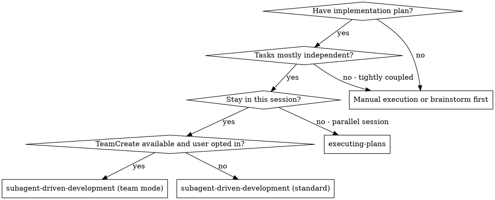
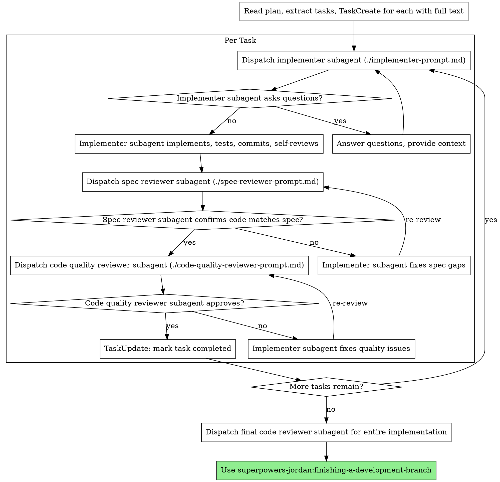
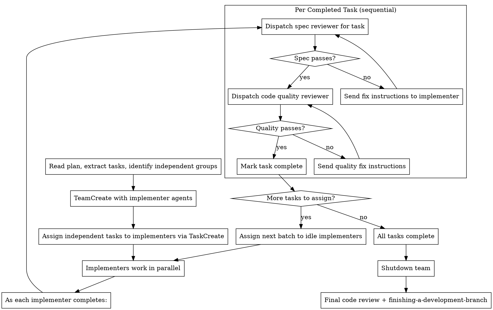

# Subagent-Driven Development

Execute plan by dispatching fresh subagent per task, with two-stage review after each: spec compliance review first, then code quality review.

**Core principle:** Fresh subagent per task + two-stage review (spec then quality) = high quality, fast iteration

## When to Use



**vs. Executing Plans (parallel session):**
- Same session (no context switch)
- Fresh subagent per task (no context pollution)
- Two-stage review after each task: spec compliance first, then code quality
- Faster iteration (no human-in-loop between tasks)

**Team mode vs. Standard mode:**
- True parallelism (multiple implementers working simultaneously on independent tasks)
- Persistent coordination via `SendMessage` and shared `TaskList`
- Review gates remain sequential per task (spec then quality)
- Requires Claude Code with teams feature enabled (beta)

## The Process



## Team Mode

When the user opts into team mode and `TeamCreate` is available, use this alternative flow instead of the standard sequential process above.

**Core difference:** Independent tasks run in parallel via team members. Review gates remain sequential per task.

### Team Composition

- **Team Lead (you):** Orchestrates work, assigns tasks, reviews results
- **Implementer agents:** One per independent task, spawned as team members
- **Reviewer agents:** Dispatched per task after implementation completes (spec then quality)

### Team Mode Process



### Key Constraints in Team Mode

- **Review gates are still sequential per task:** spec review must pass before code quality review
- **Dependent tasks must wait:** only dispatch tasks whose dependencies are complete
- **Implementers on different tasks in parallel is OK:** they work on separate files
- **Implementers on the same task is NOT OK:** one implementer per task
- **Team lead handles review dispatch:** don't delegate review scheduling to implementers
- **Use SendMessage for fix instructions:** when a reviewer finds issues, message the implementer with specific fixes needed
- **Use shared TaskList for tracking:** in team mode, the team's `TaskList` replaces `TodoWrite` as the single source of truth for task state. Do not maintain both simultaneously to avoid split-brain state

### Team Lifecycle

**Note:** `TeamCreate`, `TaskCreate`, `TaskUpdate`, `TaskList`, `SendMessage`, and `TeamDelete` are Claude Code built-in tools provided by the runtime as part of the teams API (currently in beta).

1. **Create:** `TeamCreate` at start of execution
2. **Staff:** Spawn implementer agents as team members via `Task` with `team_name`
3. **Assign:** Create tasks via `TaskCreate`, assign via `TaskUpdate` with `owner`
4. **Coordinate:** Use `SendMessage` for review feedback, fix instructions
5. **Shutdown:** Send `shutdown_request` to all team members when complete
6. **Cleanup:** `TeamDelete` after all members shut down

## Prompt Templates

- `./implementer-prompt.md` - Dispatch implementer subagent
- `./spec-reviewer-prompt.md` - Dispatch spec compliance reviewer subagent
- `./code-quality-reviewer-prompt.md` - Dispatch code quality reviewer subagent

## Example Workflow

```
You: I'm using Subagent-Driven Development to execute this plan.

[Read plan file once: docs/plans/<feature-name>/feature-plan.md]
[Extract all 5 tasks with full text and context]
[TaskCreate for each task with full description]

Task 1: Hook installation script

[Get Task 1 text and context (already extracted)]
[Dispatch implementation subagent with full task text + context]

Implementer: "Before I begin - should the hook be installed at user or system level?"

You: "User level (~/.config/superpowers/hooks/)"

Implementer: "Got it. Implementing now..."
[Later] Implementer:
  - Implemented install-hook command
  - Added tests, 5/5 passing
  - Self-review: Found I missed --force flag, added it
  - Committed

[Dispatch spec compliance reviewer]
Spec reviewer: ✅ Spec compliant - all requirements met, nothing extra

[Get git SHAs, dispatch code quality reviewer]
Code reviewer: Strengths: Good test coverage, clean. Issues: None. Approved.

[Mark Task 1 complete]

Task 2: Recovery modes

[Get Task 2 text and context (already extracted)]
[Dispatch implementation subagent with full task text + context]

Implementer: [No questions, proceeds]
Implementer:
  - Added verify/repair modes
  - 8/8 tests passing
  - Self-review: All good
  - Committed

[Dispatch spec compliance reviewer]
Spec reviewer: ❌ Issues:
  - Missing: Progress reporting (spec says "report every 100 items")
  - Extra: Added --json flag (not requested)

[Implementer fixes issues]
Implementer: Removed --json flag, added progress reporting

[Spec reviewer reviews again]
Spec reviewer: ✅ Spec compliant now

[Dispatch code quality reviewer]
Code reviewer: Strengths: Solid. Issues (Important): Magic number (100)

[Implementer fixes]
Implementer: Extracted PROGRESS_INTERVAL constant

[Code reviewer reviews again]
Code reviewer: ✅ Approved

[Mark Task 2 complete]

...

[After all tasks]
[Dispatch final code-reviewer]
Final reviewer: All requirements met, ready to merge

Done!
```

## Advantages

**vs. Manual execution:**
- Subagents follow TDD naturally
- Fresh context per task (no confusion)
- Parallel-safe (subagents don't interfere)
- Subagent can ask questions (before AND during work)

**vs. Executing Plans:**
- Same session (no handoff)
- Continuous progress (no waiting)
- Review checkpoints automatic

**Efficiency gains:**
- No file reading overhead (controller provides full text)
- Controller curates exactly what context is needed
- Subagent gets complete information upfront
- Questions surfaced before work begins (not after)

**Quality gates:**
- Self-review catches issues before handoff
- Two-stage review: spec compliance, then code quality
- Review loops ensure fixes actually work
- Spec compliance prevents over/under-building
- Code quality ensures implementation is well-built

**Cost:**
- More subagent invocations (implementer + 2 reviewers per task)
- Controller does more prep work (extracting all tasks upfront)
- Review loops add iterations
- But catches issues early (cheaper than debugging later)

## Red Flags

**Never:**
- Start implementation on main/master branch without explicit user consent
- Skip reviews (spec compliance OR code quality)
- Proceed with unfixed issues
- Dispatch multiple implementation subagents in parallel (conflicts)
- Make subagent read plan file (provide full text instead)
- Skip scene-setting context (subagent needs to understand where task fits)
- Ignore subagent questions (answer before letting them proceed)
- Accept "close enough" on spec compliance (spec reviewer found issues = not done)
- Skip review loops (reviewer found issues = implementer fixes = review again)
- Let implementer self-review replace actual review (both are needed)
- **Start code quality review before spec compliance is ✅** (wrong order)
- Move to next task while either review has open issues

**Team mode specific - Never:**
- Use team mode when `TeamCreate` is not available (fall back to standard mode)
- Assume team mode works on non-Claude-Code environments (Codex, OpenCode)
- Skip the user choice - always ask before spawning a team
- Let implementers self-assign tasks (team lead assigns via `TaskUpdate`)
- Forget to shutdown the team (always send `shutdown_request` + `TeamDelete`)

**If subagent asks questions:**
- Answer clearly and completely
- Provide additional context if needed
- Don't rush them into implementation

**If reviewer finds issues:**
- Implementer (same subagent) fixes them
- Reviewer reviews again
- Repeat until approved
- Don't skip the re-review

**If subagent fails task:**
- Dispatch fix subagent with specific instructions
- Don't try to fix manually (context pollution)

## Integration

**Required workflow skills:**
- **superpowers-jordan:writing-plans** - Creates the plan this skill executes
- **superpowers-jordan:requesting-code-review** - Code review template for reviewer subagents
- **superpowers-jordan:finishing-a-development-branch** - Complete development after all tasks

**Subagents should use:**
- **superpowers-jordan:test-driven-development** - Subagents follow TDD for each task

**Alternative workflow:**
- **superpowers-jordan:executing-plans** - Use for parallel session instead of same-session execution
